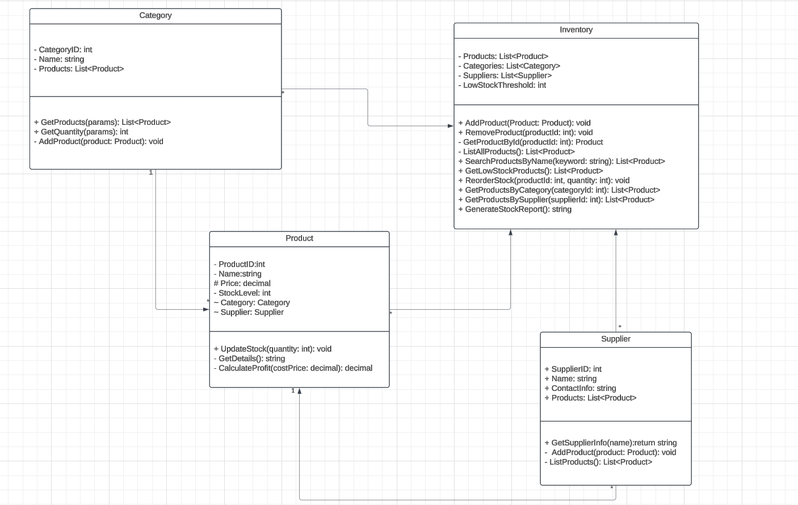

# InventiCore - Inventory Management System
### A console-based inventory management system to manage products, categories, and suppliers.

## Overview
InventiCore is a console-based inventory management system designed to help businesses efficiently manage their inventory.
It provides features such as adding and removing products, categorizing items, tracking suppliers, and generating reports.

## Features
- Add, remove, and search for products.
- Organize products into categories.
- Track suppliers for each product.
- Identify low-stock products using a configurable threshold.
- Generate a detailed stock report.

## System Design
Below is the UML diagram that illustrates the system's architecture:

## Getting Started 

### Prerequisites
- .NET SDK (version 6)
- A code editor like Visual Studio or Visual Studio Code

### Setup
1. Clone the repository
2. cd InventiCore
3. dotnet run 